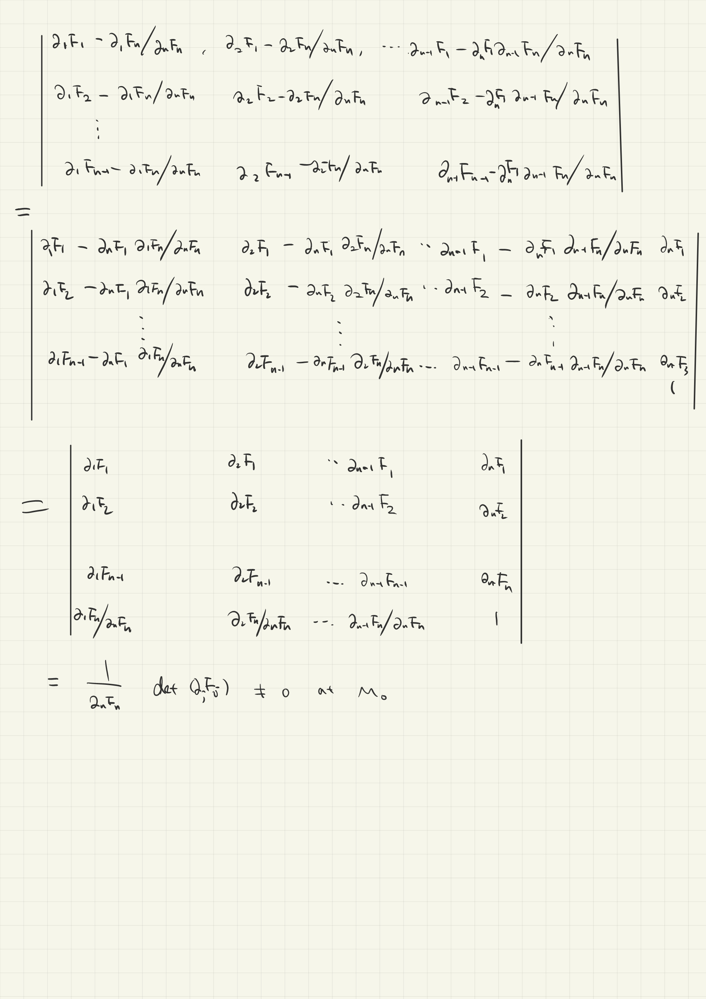

# Handout-Implicit Function Theorem (IFT)

1. (toy) $f\in C^{1}(\R),$ and  $f'(x_0)>0$，then there exists  nbds $U,V$ of $x_0,y_0:=f(x_0)$ resp ,such as $\delta_{x},\delta_{y}$ nbds, such that for any $y\in V$，there is the unique $x\in U $ with $f(x)=y$. Roughtly speaking, $f$ is a local homeo near $x_0$.

   **pf:** $f'>0$ near $x_0$,implies that $f$ is strictly increasing near $x_0$ from mean value theorem or def of cts of derivative func. Thus, say $f$ maps $[x_0-\delta_x,x_0+\delta_x]=:U$ to $[y_0-\delta_y,y_0+\delta_y]=:V$. As the map is from cpt space to $T_2$, the injection is a homeo. Hence, the inverse $y\in V\mapsto x\in U$ exists and is a homeo.    $\square$ 

   

2. (toy) $f\in C^{1}(\R,\R^n),$ and  $y_i'(x_0)\neq 0,i=1,2\dots,n$，then the result is similar. Essentiallly $f$ is a local homeo near $x_0$ from interval to a spatial curve.

   **pf:** Repeatedly take small $\delta_{y_{i}}$ nbd.  $\square$ 

   

3. (toy) $f\in C^{1}(\R,\R^n),$ and  $\nabla f(x_0)\neq 0$，then there exists  nbds $U,V$ of $x_0,y_0:=f(x_0)$ resp ,such as $\delta_{x},\delta_{y}$ nbds, such that for any $y\in V$，there is the unique $x\in U $ with $f(x)=y$. Roughtly speaking, $f$ is a local homeo near $x_0$.

   **Rmk:**Counter-eg $f(x,y)=(x^2,y)$ at $(0,0)$.  

   

4. (key) Let $F\in C^{1}(D),D\subset \R^2$ and open. Take a point $M_0:=(x_0,y_0)\in D$ with $\nabla F|_{M_0}\neq 0$, wlog say $F_{y}(M_0)>0$, then the equation determines a curve $y=y(x)$ near $x_0$ though $M_0$, i.e. $\exists$ nbd  $U\times V$ of $(x_0,y_0)$ with $U\times V\subset D$ for any $x\in U $, there exists the unique $y\in V$ satisfying the eq $F(x,y)=0$. The function $x\mapsto y$ denoted by $y=g(x)$, is also $C^1$ in $U$.

   **pf:** step1 Continuty shows that we can imagine the $F=0$ is like a steep slope(陡坡) towards the direction of $z$(imagine the non-zeros vector and a concrete slope).

   ​	step2 Zero thm guarante the corespondence.

   ​	step3 Monotonicity shows that map is 1-1.

   ​	step4 $f$ is cts.

   ​	step4 $f'$ exists and the expression shows C1.

   

5. (surface) Let $F\in C^{1}(D),D\subset \R^3$ and open. Take a point $M_0:=(x_0,y_0,z_0)\in D$ with $\nabla F|_{M_0}\neq 0$, wlog say $F_{z}(M_0)>0$, then the equation determines a surface $z=z(x,y)$ near $x_0$ though $M_0$, i.e. $\exists$ nbd  $U_1\times  U_2\times U_3$ of $M_0$ with $U\times U_2\times U_3\subset D$ for any $(x,y)\in U_1\times U_2 $, there exists the unique $z\in U_3$ satisfying the eq $F(x,y,z)=0$. The map $(x,y)\mapsto z$ denoted by $z=g(x,y)$, is also $C^1$ in $U$.

   **Rmk:** Geometrically $f(x,y,z)$ detmines a surface which is not a graph of a function since it may happens that $(x_0,y_0)$ corresponds to at least points $z_1,z_2$. But we know the surface admits a good paramterization in our minds, s.t. it locally is like a graph of function (Monge form). The prop tells that we can "solve" the relation of 2 variables as a surface every where unless near critical point. In fact, near critical point $\nabla F=0$, it can't be a graph in $\R^3$.(Examples are obvious.)

6. ($n>3$) Let $F\in C^{1}(D),D\subset \R^n$ and open. Take a point $M_0:=(x_1,x_2,\dots,x_n)\in D$ with $\nabla F|_{M_0}\neq 0$, wlog say $F_{x_n}(M_0)>0$, then the equation determines a hypersurface(patch) in $\R^{n}$ $y_n=g(y_{1:n-1})$ near $x_{1:n-1}$ though $M_0$, i.e. $\exists$ nbd  $U_{1:n}$ of $M_0$ with $U_{1:n}\subset D$ for any $(y_{1:n-1})\in U_{1:n-1} $, there exists the unique $y_n\in U_n$ satisfying the eq $F(y_{1:n})=0$. The map $(y_{1:n-1})\mapsto y_{n}$ denoted by $y_n=g(y_{1:n-1})$, is also $C^1$ in $U$.

   

7. (2-2) Let $F_1,F_2,\in C^{1}(D),D\subset \R^4$ and open. Take a point $M_0:=(\vec{x_0}=(x_1,x_2),\vec{y_0}=(y_1,y_2))\in D$ with $\det F_y|_{M_0}\neq 0$, then the equation determines a map  $\vec{y}=g(\vec{x})$ near $\vec{x_0}$ , i.e. $\exists$ nbd  $U_{1:4}$ of $M_0$ with $U_{1:4}\subset D$ for any $(x'_{1:2})\in U_{1:2} $, there exists the unique  $(y'_{1:2})\in U_{3:4}$ satisfying the eq $F(x'_{1:2},y'_{1:2})=0$. The map $(x'_{1:2})\mapsto y'_{1:2}$ denoted by $y_{1:2}=g(x_{1:2})$, is also $C^1$ in $U$.

   **pf:** **Argument:elimination variables**(消元法), back to the case as before.

   Step1 

   wlog $\partial_{x_2}(y_2)\neq 0$, then we know $y_2$ is a function of $(x_{1:2},y_1)$. Substitute $y_2$ expression for the $1^{st}$ formula, we have $F'_1=F_1(x_1,x_2,y_1,y_2(x_1,x_2,y_1))$, then we only need to guarantee that $\partial_{y_1}F'_{1}\neq 0$ at $M_0$, then we are ok.

   Step2 Verify by computation.
   $$
   \partial_{y_1}F'_{1}=\partial_{y_1}F_{1}+\partial_{y_2}F_1\cdot\partial_{y_1}y_{2}
   $$
   substitute $\partial_{y_1}y_{2}$ by $-\partial_{y_1} F_2/\partial_{y_2} F_2$,then
   $$
   \partial_{y_1}F'_{1}=\partial_{y_1}F_{1}-\partial_{y_2}F_1\cdot\partial_{y_1} F_2/\partial_{y_2} F_2\\
   =\partial_{y_1}F_{1}\cdot\partial_{y_2} F_2-\partial_{y_2}F_1\cdot\partial_{y_1} F_2)/\partial_{y_2} F_2\\
   =\frac{\det F_{y}}{\partial_{y_2} F_2}\neq 0
   $$
    Step3 Repeated application of the key lemma.

   We're done.

   $\square$

8. (m-n) Let $F_1,F_2,\in C^{1}(D),D\subset \R^{m+n}$ and open. Take a point $M_0:=(\vec{x_0}=(x_1:m),\vec{y_0}=(y_1:n))\in D$ with $\det F_y|_{M_0}\neq 0$, then the equation determines a map  $\vec{y}=g(\vec{x})$ near $\vec{x_0}$ , i.e. $\exists$ nbd  $U_{1:m+n}$ of $M_0$ with $U_{1:m+n}\subset D$ for any $(x'_{1:m})\in U_{1:m} $, there exists the unique  $(y'_{1:n})\in U_{m+1:m+n}$ satisfying the eq $F(x'_{1:m},y'_{1:n})=0$. The map $(x_{1:2})\mapsto y_{1:2}$ denoted by $y_{1:2}=g(x_{1:2})$, is also $C^1$ in $U$.

   **pf:** **Argument:elimination variables**(消元法), back to the case as before.

   Step1 

   wlog $\partial_{x_n}(y_n)\neq 0$,then we know $y_2$ is a function of $(x_{1:m},y_{1:n-1})$. 

   Substitute $y_n$ expression for the first $n-1$ formulas, we have $F'_i=F_1(x_{1:m},y_{1:m-1})$, then we only need to guarantee that $\det F'_{y}\neq 0$ at $M_0$, then we are ok.

   Step2 Verify by pure computation.
   $$
   \partial_{y_j}F'_{i}=\partial_{y_j}F_{i}+\partial_{y_n}F_i\cdot\partial_{y_j}y_{2}
   $$
   substitute $\partial_{y_j}y_{n}$ by $-\partial_{y_j} F_m/\partial_{y_n} F_m$,then in shorthand,
   $$
   \partial_{j}F'_{i}=\partial_{j}F_{i}-\partial_{n}F_i\cdot\partial_{j}F_n/\partial_n F_n.
   $$
   Step3 compute 
   $$
   \det F'_{y}=\sum sgn(i_1,\dots,i_{n-1})\partial_{1}F'_{i_1}\dots \partial_{n-1}F'_{i_{n-1}}\\
   =\sum sgn(i_1,\dots,i_{n-1})(\partial_{i_1}F_{1}-\partial_{n}F_{1}\cdot\partial_{i_1}F_n/\partial_n F_n)\\\cdots
   (\partial_{i_{k}}F_{k}-
   \partial_{i_k}F_{k}\cdot\partial_{i_k}F_n/\partial_n F_n)
   \\\cdots
   (\partial_{i_n}F_{n}-
   \partial_{i_n}F_{n}\cdot\partial_{i_n}F_n/\partial_n F_n)
   $$
   Simplified as 
   $$
   \det F'_{y}=(\frac{1}{\partial_nF_n})^{n-1}
   \sum sgn(i_1,\dots,i_{n-1})\\
   (\partial_{i_1}F_{1}\cdot \partial_n F_n-\partial_{n}F_{1}\cdot\partial_{i_1}F_n)
   \\\cdots
   (\partial_{i_{k}}F_{k}\cdot \partial_n F_n-
   \partial_{n}F_{k}\cdot\partial_{i_k}F_n)
   \\\cdots
   (\partial_{i_n}F_{n}\cdot \partial_n F_n-
   \partial_{n}F_{n}\cdot\partial_{i_n}F_n)
   $$
   The compuation is so difficult that we'd better use matrix to simplify it:

   

   Thus you can carry the inductive step.

   Step4 Repeated elimination.

   We're done.

   $\square$

   

   **Summary:** **IFT** is the particular case of **regular value thm**, if write $\bold{F}:=(F_1,\cdots,F_m):\R^{n+m}\to \R^{m}$ and $\text{d}\bold{F}$ has rank $m$ at some $M_0\in \R^{n+m}$ with $\bold{F}(M_0)=0$, then the intersection of $\bold{F}^{-1}(0)$  with a small open ball of $M_0$ is an open set in $\R^{n}$. If it holds for any $M$ in locus of $\bold{F}$, then it shows that $\bold{F}^{-1}(0)$ is a codim $m$ surface in $\R^{n+m}$.

   

### Exercise

1. (The excise tells mainly that the expression of a hypersurface is always  difficult even if it is a polynomial in 2 variables, but the analytic tool, our theme **IFT** shows that you can regard almost all patch as a graph except some critical points. The advantage is that you don't have to compute the complicated operation to get the local geometric shape and its dimension.) Compute the critical points of $F(x,y)=1+x^2y+xy^3$.

   **pf:** If $M\neq (0,0)$ , then the patch near $M$ is a graph like $y=y(x)$ or $x=x(y)$.

2. What can you say the shape of the obj detemined by 2 eqs 
   $$
   \begin{cases}
   x^2+y^2-z^2+w^2=0\\
   x+y-z^2+w^3+1=0
   \end{cases}
   $$
   **The ex tells that the advantage of IFT  in multi-var. is to show when we can claim(断言) the intersection of "$4$-dim" objs is "2-dim". IFT describes the thing precisely.** 

### App

1. submersion(regular value theorem)
2. immersion
3. constant rank theorem
4. pde **要举例**

### Todo

这个假期或者开学后不久找个时间做个静态网站，把这些我写的markdown放在上面做一些整理和展示，还有我的CV那些