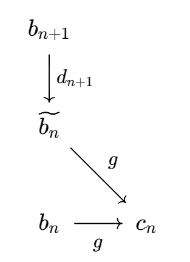
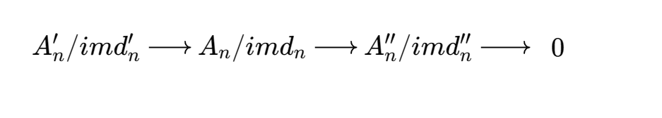
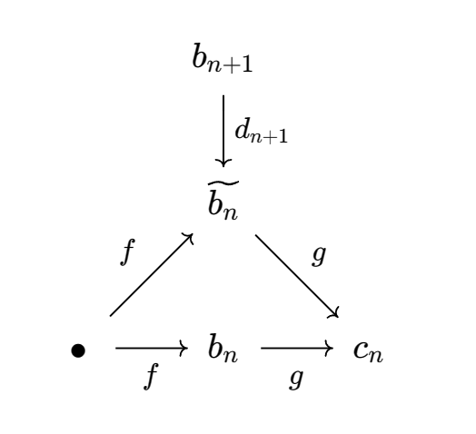
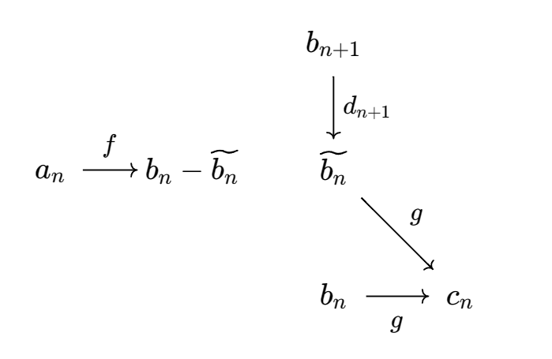

### 路径追踪中的典型结构

---

*原则，找结构，建立传送点，而不是重复造轮子。*

结构1 

找差量，逆追踪，一般体现为三角结构。若给出以下结构

由于 $g $ 作用在两个点上是一样的，即两者差一个ker$g$ 中的元素， 只需要 $B_n$ 处正合，则逆向追踪，显示出 $a_n\to b_n-\widetilde{b_{n}}$ ,因此 $f(a_n)$ 几乎就是 $b_n$ ，两者差一个 $im \,d_{n+1}$ 中的元素，因此 这个方法用在蛇形引理的习题中，恰好用于验证 

第一行中间的正合性：

  

#### 实用引理

**右U引理** 设下列交换图行正合，可知存在 $h:C\to C'$ 使得图可交换。
$$
\begin{CD} 
A @>{}>> B@>{}>>C @>{}>>0\\ 
@V{f}VV @V{g}VV @. \\ 
A' @>{}>> B'@>{}>>C' @>{}>>0\\ 
\end{CD}
$$
证明：

（a) 若 $g$ 满，则 $h$ 满；

（b) 若 $g$ 单 $f$ 满，则 $h$ 单；

（c) 若 $g$ 同构，且 $f$ 满，则 $h$ 同构。

**证明**

（a）$h$ 满
$$
\begin{CD} 
 @>{}>> b@>{}>>c @>{}>>\\ 
@V{}VV @V{g}VV @V{h}VV \\ 
 @>{}>> b'@>{}>>c' @>{}>>\\ 
\end{CD}
$$
给定 $c'\in C'$ 则逆向追踪 $b'\in B\mapsto c'$ , $b\in B\mapsto b\mapsto c$ ，由交换图， $c\mapsto c'$.  反之，若 $h$ 满，则给出 $b'\in B'$ 则 $b'\to c' \to c \to b$ 箭头仅代表追踪顺序，则知 $b$ 和 $b'$ 相差一个ker元，不保证满。

（b） $h$ 单
$$
\begin{CD} 
 a@>{}>> b@>{}>>c @>{}>>\\ 
@V{}VV @V{g}VV @V{h}VV \\ 
 a'@>{}>> b'@>{}>>0 @>{}>>\\ 
\end{CD}
$$
给出 $c\to 0$, 遍历顺序 $c\to b\to b' \to 0 \to  a'\to a\to b\to c=0$ ,因此 $c=0$ 即 $h$ 单，其中 $a'\to a$ 用到 $f$ 满，$a\to b$ 利用了 $g$ 单，保证绕一大圈回到了 $b$. 

（c）由 (a),(b)可得。

$\square $

**左U引理** 设下列交换图行正合，可知存在 $h:A\to A'$ 使得图可交换。

$$
\begin{CD} 
0@>{}>> A @>{i}>> B@>{}>>C \\ 
@. @.  @V{f}VV @V{g}VV @. \\ 
0@>{}>>A' @>{j}>> B'@>{}>>C'\\ 
\end{CD}
$$
证明：

（a) 若 $f$ 单，则 $h$ 单；

（b) 若 $f$ 满 $g$ 单，则 $h$ 满；

（c) 若 $g$ 同构，且 $f$ 满，则 $h$ 同构。

**证明** 

（a）设 $h(a)=0$, 由于 $0=jh(a)=fi(a)$ 而 $f$ 单，因此 $i(a)=0$ , $i$ 单，进而 $a=0$, $h$ 单 。

（b)...证明完全对偶于右U引理，留给读者练习。

$\square $ 

**五引理** 给定5个模，13个同态的一幅图，讨论的是中间竖线箭头的单满问题（追踪问题）。设下列交换图行正合，
$$
\begin{CD} 
A @>{}>> B@>{}>>C @>{}>>D @>{}>>F\\ 
@V{h_1}VV @V{h_2}VV @V{h_3}VV @V{h_4}VV @V{h_5}VV \\ 
A' @>{}>> B'@>{}>>C' @>{}>>D' @>{}>>F'\\ 
\end{CD}
$$
证明：

（a）若 $h_2,h_4$ 单，$h_1$ 满，则 $h_3$ 单；

（b）若 $h_2,h_4$ 满，$h_5$ 单，则 $h_3$ 满；【(a) 的对偶语句】

（c）特别地，$h_i$ 都是同构 ($i\neq 3$) ,则 $h_3$ 是同构。

**证明** 

（a）设 $c\to 0$, 则追踪顺序为 $c\to 0\to 0 \to d=0 \to b \to b' \to a' \to a\to b\to c=0$ ,从 $c$ 回到 $c=0$ ,因此 $h_3$ 单。
$$
\begin{CD} 
a @>{}>> b@>{}>>c @>{}>>d=0 @>{}>>F\\ 
@V{h_1}VV @V{h_2}VV @V{h_3}VV @V{h_4}VV @V{h_5}VV \\ 
a' @>{}>> b'@>{}>>0 @>{}>>0 @>{}>>F'\\ 
\end{CD}
$$

（b）
$$
\begin{CD} 
A @>{}>> B@>{}>>c @>{}>>d @>{}>>0\\ 
@V{h_1}VV @V{h_2}VV @V{h_3}VV @V{h_4}VV @V{h_5}VV \\ 
A' @>{}>> B'@>{}>>c' @>{}>>d' @>{}>>0\\ 
\end{CD}
$$
由于 $c$ 的像 $c''$ 和 $c'$ 差一个 $b'$ 的像，进而追到 $b$ , 给 $c$ 补偿一个 $b$ 的像，得出补偿后的像恰为 $c'$. 这种结构要烂熟于心，而不是重复造轮子。 

（c）实用中，$h_i$ 都是同构 ($i\neq 3$) ,则 $h_3$ 是同构。

$\square $

五引理的一种特殊形式是可交换图，短正合列
$$
\begin{CD} 
0 @>{}>> B@>{}>>C @>{}>>D @>{}>>0\\ 
@. @V{h_2}VV @V{h_3}VV @V{h_4}VV @.\\ 
0 @>{}>> B'@>{}>>C' @>{}>>D' @>{}>>0\\ 
\end{CD}
$$
如果 $h_2,h_4$ 单（满），则$h_3$ 单（满）。

那么这是否有一般性呢？并且 Barrat-WhiteHead 和M-V 的拓扑解释在哪里呢？这里的内涵绝不是代数所能囊括的。

**$3\times 3 $ 引理** 当上面两行正合时，则第三行正合；若下面两行正合时，则第三行正合，对称地，列也是如此。

$$
\begin{CD} 
@.0 @.0 @.0\\ 
@. @V{}VV @V{}VV @V{}VV @.\\ 
0 @>{}>> B@>{}>>C @>{}>>D @>{}>>0\\ 
@. @V{}VV @V{}VV @V{}VV @.\\ 
0 @>{}>> B'@>{}>>C' @>{}>>D' @>{}>>0\\ 
@. @V{}VV @V{}VV @V{}VV @.\\ 
0 @>{}>> B''@>{}>>C'' @>{}>>D'' @>{}>>0\\ 
@. @V{}VV @V{}VV @V{}VV @.\\
@.0 @.0 @.0\\ 
\end{CD}
$$

**引理** 给定下面交换图，行正合。证明：若第二行，第三列短正合，则第三行短正合；对称地，若第二列，第三行短正合，则第三列短正合。
$$
\begin{CD} 

 B@>{}>>C @>{}>>D @>{}>>0\\ 
 @V{}VV @V{}VV @V{}VV\\ 
B'@>{}>>C' @>{}>>D' @>{}>>0\\ 
 @V{}VV @V{}VV @V{}VV @.\\ 
B''@>{}>>C'' @>{}>>D'' @>{}>>0\\ 
 @V{}VV @V{}VV @V{}VV @.\\
0 @.0 @.0\\ 
\end{CD}
$$
**证明** 图上追猎法。

#### Rotman 路径追踪的典型技巧

针对具体问题构造合适的正合列的常用技巧，特定问题的处理策略

一种tensor的技巧，实现将两个列tensor在一起，然后从右下角开始递归，这个方法使用在 证明 $Tor=tor$ 

+ 针对射影对象（内射对象），用 **比较引理** 

---

#### doing

【【

单射、满射的路径哲学：

下意识的反应：题目中的单射满射条件应该下意识地翻译为动态追踪的条件。如 右U结构，两个行右正合，使得逆向追踪非常方便。

逆向追踪——满射

先正再逆——单射,**保证追了一大圈之后打回来的正好是所遍历过的，可实践检验**

】】

整理出追图的结构

使得自己能够在有朝一日，需要用到追图的时候，很容易地看着这个资料，就可能直接上手构造特殊的引理，而不是在草稿本前冥思苦想。别人早已经想出来的东西，不要停留在那上面太长时间。

